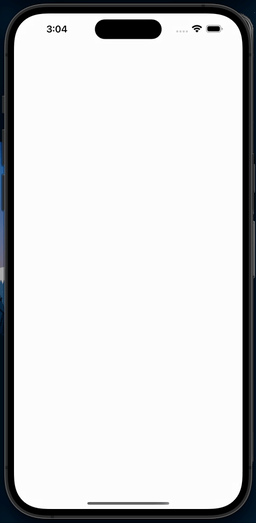

# Flutter Golden Ratio Visualization

Discover the mesmerizing dance of the Golden Ratio in Flutter's animated visualization.

The Golden Ratio, often symbolized by φ (phi), is a mathematical concept widely observed in nature
and cherished in art, architecture, and design for its aesthetic allure.

### Demo

The visualization consists of two arms. The first arm rotates in the plane according to the angle θ,
while the second arm rotates at a rate φ (phi) times faster than the first arm. Points are then
drawn at the end of the first arm to visualize the resulting path.

Efforts are underway to optimize the performance of the visualization for smoother output.

If you have any suggestions, feedback, please feel free to reach out.
